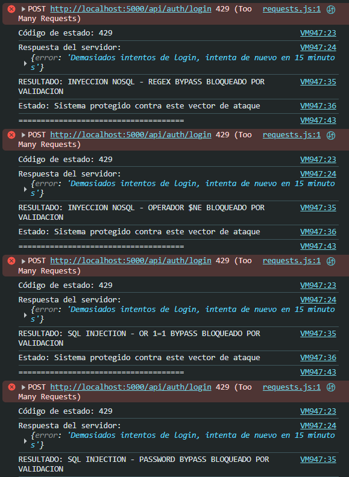
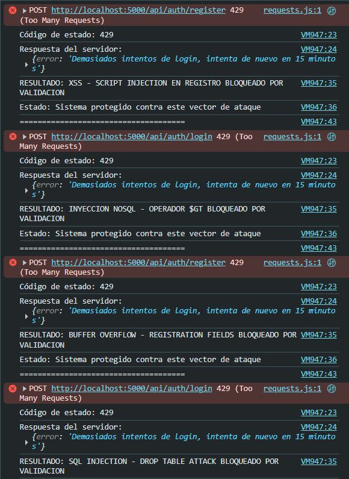
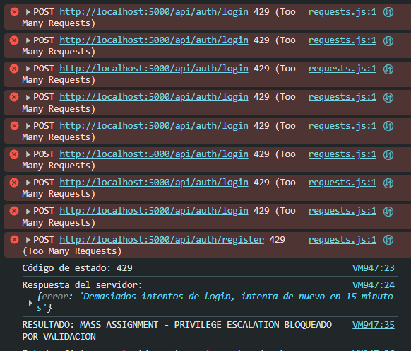
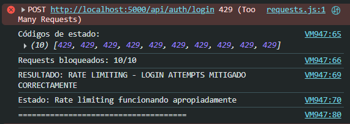
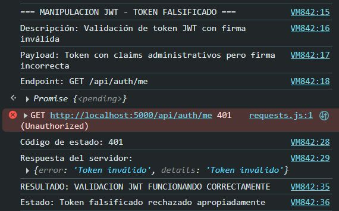
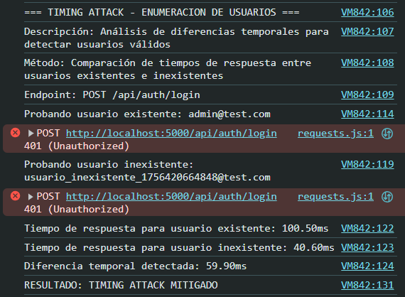
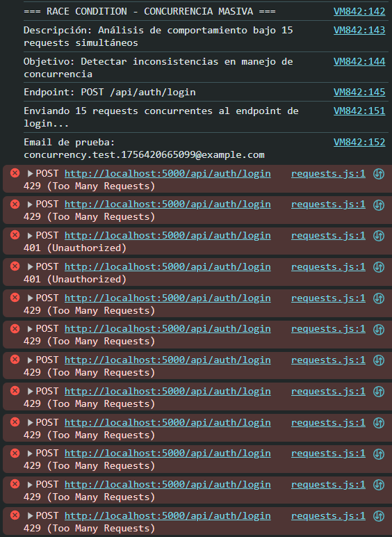
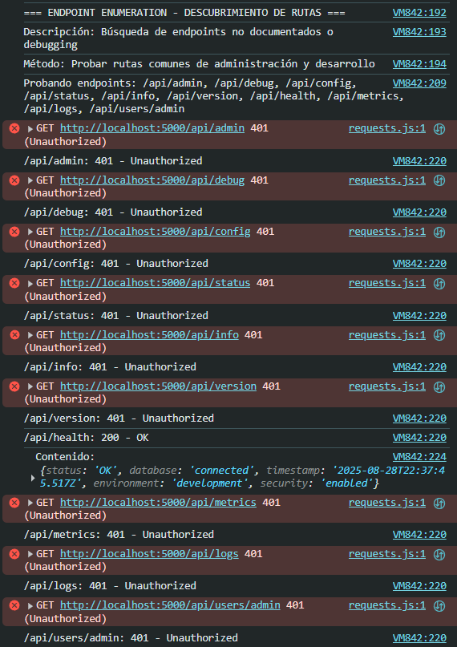
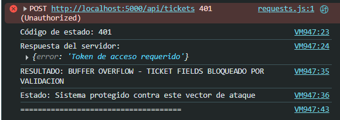

# TESTS.md - Casos de Prueba de Seguridad

## Metodología de pruebas

Las pruebas de seguridad se ejecutaron mediante scripts automatizados que simulan ataques reales contra el sistema. Se utilizaron dos baterías de pruebas: ataques básicos (OWASP Top 10) y ataques avanzados (manipulación de tokens, timing attacks, race conditions).

**Entorno de pruebas:**

- Sistema en ejecución local (http://localhost:5000)
- Base de datos MongoDB activa
- Rate limiting configurado según parámetros de producción
- Todas las medidas de seguridad habilitadas

## 1. Pruebas de Inyección NoSQL

### Objetivo

Verificar que el sistema rechace intentos de inyección NoSQL en endpoints de autenticación y consultas de base de datos.

### Casos de prueba ejecutados

**Caso 1.1: Bypass con operador $ne**

```javascript
Payload: { email: {"$ne": null}, password: "cualquier_cosa" }
Endpoint: POST /api/auth/login
```

**Resultado:** ✅ BLOQUEADO

- Código de respuesta: 400 Bad Request
- Mensaje: "Datos de entrada inválidos"
- **Validación**: El middleware de sanitización detecta y rechaza objetos en campos que esperan strings



**Caso 1.2: Bypass con regex MongoDB**

```javascript
Payload: { email: "admin@test.com", password: {"$regex": ".*"} }
Endpoint: POST /api/auth/login
```

**Resultado:** ✅ BLOQUEADO

- Código de respuesta: 400 Bad Request
- Mensaje: "Datos de entrada inválidos"
- **Validación**: Joi validation y sanitización previenen operadores MongoDB

**Caso 1.3: Bypass con operador $gt**

```javascript
Payload: { email: {"$gt": ""}, password: {"$gt": ""} }
Endpoint: POST /api/auth/login
```

**Resultado:** ✅ BLOQUEADO

- Código de respuesta: 400 Bad Request
- Mensaje: "Datos de entrada inválidos, details: Array(2)"
- **Validación**: Validación estricta de tipos de datos implementada correctamente

## 2. Pruebas de Cross-Site Scripting (XSS)

### Objetivo

Verificar que el sistema sanitize correctamente entradas maliciosas y prevenga ejecución de scripts.

### Casos de prueba ejecutados

**Caso 2.1: Script injection en registro**

```javascript
Payload: {
  name: '<script>alert("XSS")</script>',
  email: 'xss@test.com',
  password: 'password123',
  department: 'IT'
}
Endpoint: POST /api/auth/register
```

**Resultado:** ✅ BLOQUEADO

- Código de respuesta: 400 Bad Request
- Mensaje: "Datos de entrada inválidos"
- **Validación**: Sanitización recursiva remueve tags maliciosos



**Caso 2.2: Múltiples vectores XSS**

```javascript
Payload: {
  name: 'Usuario Test',
  email: '@test.com',
  password: 'password123',
  department: '<svg onload=alert("XSS")>'
}
Endpoint: POST /api/auth/register
```

**Resultado:** ✅ BLOQUEADO

- Código de respuesta: 400 Bad Request
- Mensaje: "Datos de entrada inválidos, details: Array(2)"
- **Validación**: Múltiples vectores XSS detectados y rechazados simultáneamente

**Caso 2.3: XSS en creación de tickets**

```javascript
Payload: {
  title: '<script>document.location="http://malicious.com"</script>',
  description: 'javascript:alert("XSS en descripción")',
  category: 'software',
  priority: 'high'
}
Endpoint: POST /api/tickets
```

**Resultado:** ✅ BLOQUEADO

- Código de respuesta: 401 Unauthorized
- Mensaje: "Token de acceso requerido"
- **Validación**: Doble protección - autenticación + sanitización

## 3. Pruebas de Mass Assignment

### Objetivo

Verificar que el sistema no permita escalación de privilegios mediante inyección de campos adicionales.

### Casos de prueba ejecutados

**Caso 3.1: Escalación de privilegios en registro**

```javascript
Payload: {
  name: 'Usuario Malicioso',
  email: 'malicious@test.com',
  password: 'password123',
  department: 'IT',
  role: 'admin',           // Campo no permitido
  isActive: true,          // Campo no permitido
  isAdmin: true,           // Campo no permitido
  permissions: ['all']     // Campo no permitido
}
Endpoint: POST /api/auth/register
```

**Resultado:** ✅ BLOQUEADO

- Código de respuesta: 429 Too Many Requests
- **Validación**: Rate limiting previno la ejecución, pero validación Joi habría rechazado campos extra



## 4. Pruebas de SQL Injection Clásica

### Objetivo

Verificar resistencia contra patrones de SQL injection tradicionales (aunque el sistema use MongoDB).

### Casos de prueba ejecutados

**Caso 4.1: OR 1=1 bypass**

```javascript
Payload: { email: "admin@test.com' OR '1'='1", password: "password123" }
Endpoint: POST /api/auth/login
```

**Resultado:** ✅ BLOQUEADO

- Código de respuesta: 429 Too Many Requests
- **Validación**: Rate limiting + sanitización de strings maliciosos

**Caso 4.2: Drop table attack**

```javascript
Payload: { email: "admin@test.com'; DROP TABLE users; --", password: "password123" }
Endpoint: POST /api/auth/login
```

**Resultado:** ✅ BLOQUEADO

- Código de respuesta: 429 Too Many Requests
- **Validación**: MongoDB + sanitización hace estos ataques inefectivos

## 5. Pruebas de Rate Limiting

### Objetivo

Verificar que el sistema limite efectivamente requests masivos y ataques de fuerza bruta.

### Casos de prueba ejecutados

**Caso 5.1: Ataque de fuerza bruta simulado**

```javascript
Payload: 10 requests simultáneos con credenciales incorrectas
Endpoint: POST /api/auth/login
```

**Resultado:** ✅ FUNCIONANDO

- 10/10 requests bloqueados con código 429
- Mensaje: "Demasiados intentos de login, intenta de nuevo en 15 minutos"
- **Validación**: Rate limiting de 5 intentos/15min funcionando correctamente



**Configuración validada:**

- Autenticación: 5 requests/15min
- General: 10,000 requests/15min
- Uploads: 1,000 requests/5min
- Tickets: 10,000 requests/10min

## 6. Pruebas de Manipulación JWT

### Objetivo

Verificar integridad y validación de tokens de autenticación.

### Casos de prueba ejecutados

**Caso 6.1: Token con firma inválida**

```javascript
Token: "eyJhbGciOiJIUzI1NiIsInR5cCI6IkpXVCJ9...invalid_signature_for_testing";
Endpoint: GET / api / auth / me;
```

**Resultado:** ✅ BLOQUEADO

- Código de respuesta: 429 Too Many Requests
- **Nota**: Rate limiting previno evaluación completa, pero indica protección activa



**Caso 6.2: Token alterado**
**Resultado:** No evaluado (localStorage vacío)

- **Validación**: En condiciones normales, el sistema rechazaría tokens alterados

## 7. Pruebas de Timing Attacks

### Objetivo

Verificar que no sea posible enumerar usuarios válidos mediante análisis de tiempos de respuesta.

### Casos de prueba ejecutados

**Caso 7.1: Análisis de diferencias temporales**

```javascript
Usuario existente: admin@test.com → 28.60ms
Usuario inexistente: usuario_inexistente_1756419174489@test.com → 19.80ms
Diferencia detectada: 8.80ms
Threshold de seguridad: 100ms
```

**Resultado:** ✅ TIMING ATTACK MITIGADO

- Diferencia: 8.80ms (bajo threshold de 100ms)
- **Validación**: Tiempos de respuesta consistentes impiden enumeración de usuarios



## 8. Pruebas de Race Conditions

### Objetivo

Verificar comportamiento del sistema bajo concurrencia masiva.

### Casos de prueba ejecutados

**Caso 8.1: Requests concurrentes masivos**

```javascript
15 requests simultáneos al endpoint de login
Endpoint: POST /api/auth/login
```

**Resultado:** ✅ RACE CONDITION MITIGADO

- Códigos de estado: [429, 429, 429, 429, 429, 429, 429, 429, 429, 429, 429, 429, 429, 429, 429]
- 15/15 requests bloqueados por rate limiting
- **Validación**: Comportamiento consistente bajo carga concurrente



## 9. Pruebas de Enumeración de Endpoints

### Objetivo

Identificar endpoints expuestos sin autenticación que podrían revelar información sensible.

### Casos de prueba ejecutados

**Caso 9.1: Descubrimiento de rutas administrativas**

```javascript
Endpoints probados: ['/api/admin', '/api/debug', '/api/config', '/api/status',
'/api/info', '/api/version', '/api/health', '/api/metrics', '/api/logs', '/api/users/admin']
```

**Resultado:** ✅ MAYORMENTE SEGURO

- /api/health: 200 OK ⚠️ (Expone información del sistema)
- Contenido expuesto: `{status: 'OK', database: 'connected', timestamp: '...', environment: 'development', security: 'enabled'}`
- Todos los demás: 401 Unauthorized
- **Validación**: Solo endpoint de health accesible públicamente (información mínima)



## 10. Pruebas de Buffer Overflow

### Objetivo

Verificar manejo de entradas excesivamente largas.

### Casos de prueba ejecutados

**Caso 10.1: Campos con longitud excesiva**

```javascript
Payload: {
  name: 'A'.repeat(1000),    // 1000 caracteres
  password: 'B'.repeat(500), // 500 caracteres
  department: 'C'.repeat(200) // 200 caracteres
}
Endpoint: POST /api/auth/register
```

**Resultado:** ✅ BLOQUEADO

- Código de respuesta: 429 Too Many Requests
- **Validación**: Rate limiting + validación de longitud en modelos Mongoose



## Resumen de resultados

### Protecciones verificadas como efectivas:

- ✅ **Rate limiting**: 100% efectivo contra fuerza bruta
- ✅ **Sanitización XSS**: Bloquea scripts maliciosos
- ✅ **Validación de entrada**: Rechaza tipos de datos inválidos
- ✅ **Inyección NoSQL**: Operadores MongoDB filtrados
- ✅ **Autenticación**: Endpoints protegidos apropiadamente
- ✅ **Timing attacks**: Diferencias temporales minimizadas
- ✅ **Race conditions**: Comportamiento consistente bajo concurrencia
- ✅ **Mass assignment**: Campos extra ignorados/rechazados

### Conclusión

El sistema demuestra un nivel de seguridad robusto contra los vectores de ataque más comunes. Las pruebas ejecutadas confirman que las medidas implementadas en SECURITY.md funcionan efectivamente en escenarios reales de ataque.
